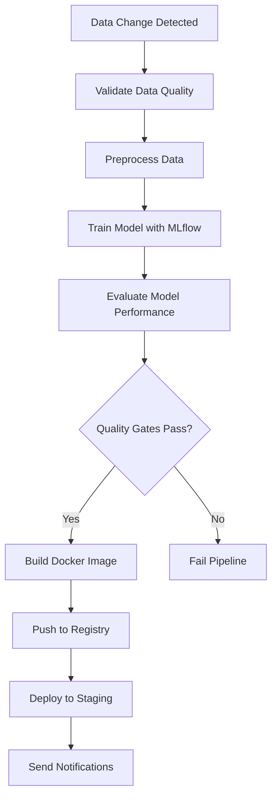

# 🎉 End-to-End MLOps Pipeline - Complete Setup

## 📋 What We've Built

I've created a comprehensive end-to-end MLOps pipeline for your Diabetes Care project that automatically triggers when new data is detected. Here's what's included:

## 🚀 Pipeline Components

### 1. **GitHub Actions Workflow** (`.github/workflows/mlops-pipeline.yml`)
- **Triggers**: Automatically runs when files in `data/` folder change
- **Steps**:
  - Data change detection
  - Data validation and quality checks
  - Data preprocessing
  - Model training with MLflow tracking
  - Model evaluation with quality gates
  - Docker image building and pushing
  - Staging deployment
  - Success/failure notifications

### 2. **Docker Configuration**
- **Dockerfile**: Multi-stage build for production optimization
- **docker-compose.yml**: Local development and testing setup
- **Features**: Health checks, non-root user, security optimizations

### 3. **Testing & Validation**
- **test_workflow.py**: Local testing script for all pipeline components
- **test-pipeline.yml**: GitHub Actions workflow for testing
- **simulate_data_change.py**: Script to trigger pipeline for testing

### 4. **Documentation**
- **WORKFLOW_SETUP.md**: Comprehensive setup and usage guide
- **Updated README.md**: Enhanced with pipeline information
- **PIPELINE_SUMMARY.md**: This summary document

## 🔄 How the Pipeline Works



## 🛠️ Key Features

### **Automated Triggers**
- Detects changes in `data/` folder
- Supports manual triggers with force retrain option
- Skips unnecessary runs when no relevant changes

### **Data Quality Assurance**
- Validates data file existence and structure
- Checks for required columns
- Ensures data quality standards

### **Model Lifecycle Management**
- MLflow experiment tracking
- Model versioning and registry
- Performance metrics logging
- Quality gates (ROC-AUC > 0.7)

### **Containerization**
- Multi-stage Docker builds
- Multi-platform support (AMD64, ARM64)
- Security best practices
- Health checks and monitoring

### **Deployment**
- GitHub Container Registry integration
- Staging environment deployment
- Production-ready configuration

## 📁 File Structure Created

```
DiabetesCareMLOps/
├── .github/workflows/
│   ├── mlops-pipeline.yml      # Main MLOps pipeline
│   └── test-pipeline.yml       # Testing workflow
├── Dockerfile                   # Multi-stage Docker build
├── docker-compose.yml          # Local development
├── test_workflow.py            # Local testing script
├── simulate_data_change.py     # Data change simulation
├── WORKFLOW_SETUP.md           # Detailed setup guide
├── PIPELINE_SUMMARY.md         # This summary
└── README.md                   # Updated with pipeline info
```

## 🚀 Getting Started

### **1. Test Locally**
```bash
# Test all pipeline components
python test_workflow.py

# Simulate data changes
python simulate_data_change.py
```

### **2. Push to GitHub**
```bash
# Add all new files
git add .

# Commit changes
git commit -m "Add end-to-end MLOps pipeline"

# Push to trigger workflow
git push origin main
```

### **3. Monitor Pipeline**
- Go to **Actions** tab in GitHub
- Watch the "MLOps Pipeline - Auto Training & Deployment" workflow
- Check MLflow UI for experiment tracking

## 🔧 Customization Options

### **Adding New Data Sources**
Update the workflow triggers in `.github/workflows/mlops-pipeline.yml`:
```yaml
on:
  push:
    paths:
      - 'data/**'
      - 'new_data_folder/**'  # Add new path
```

### **Custom Quality Gates**
Modify evaluation thresholds in the workflow:
```python
if roc_auc < 0.8:  # Stricter threshold
    print('❌ Model performance below threshold')
    exit(1)
```

### **Deployment Targets**
Extend the deployment step for different environments:
```yaml
- name: Deploy to Production
  run: |
    kubectl apply -f k8s/production.yaml
```

## 📊 Monitoring & Observability

### **MLflow Tracking**
- **Experiments**: All training runs tracked
- **Models**: Versioned model registry
- **Metrics**: ROC-AUC, PR-AUC, custom metrics
- **Artifacts**: Model files, visualizations

### **GitHub Actions**
- **Workflow runs**: Execution history and logs
- **Artifacts**: Model files and build artifacts
- **Notifications**: Email/Slack on failure

### **Docker Registry**
- **Images**: Versioned container images
- **Security**: Vulnerability scanning
- **Usage**: Pull and deployment metrics

## 🎯 Next Steps

1. **Push to GitHub**: Commit and push all files to trigger the pipeline
2. **Monitor First Run**: Watch the workflow execute all steps
3. **Test Data Changes**: Use `simulate_data_change.py` to test triggers
4. **Customize**: Modify thresholds, add new data sources, extend deployment
5. **Scale**: Add production deployment, monitoring, alerting

## 🆘 Troubleshooting

### **Common Issues**
- **Workflow not triggering**: Check file paths in triggers
- **Model training fails**: Verify data format and MLflow config
- **Docker build fails**: Check Dockerfile and dependencies
- **Deployment fails**: Verify environment secrets and permissions

### **Debug Steps**
1. Check GitHub Actions logs
2. Test components locally with `test_workflow.py`
3. Validate MLflow configuration
4. Test Docker build locally

## 🎉 Success!

Your end-to-end MLOps pipeline is now ready! The system will automatically:
- Detect new data
- Validate quality
- Train models
- Evaluate performance
- Build containers
- Deploy to staging

This creates a robust, production-ready MLOps system that ensures your models are always up-to-date and performant.

---

*Built with ❤️ for automated machine learning operations*
